### Hi there 👋

## About Me
- I am a self-taught iOS developer with a focus on Swift and SwiftUI. 
- I began my journey with Swift as a side project while pursuing my studies.
- Motivated by my love for coding and problem-solving.
- I also delved into Java to broaden my skill set.

## Hobbies
- Coding 👨🏻‍💻
- Photograph 📸
- Archery 🏹

## Projects

### [Archery Scorer](https://github.com/ElvisWong213/Archery-Scorer)

Archery Scorer is designed for archery enthusiasts to keep track of their scores, analyze their progress, and share their achievements on social media platforms.

#### Framework Used

| SwiftUI :iphone: | CoreData :floppy_disk: | CloudKit :cloud: | WidgetKit :control_knobs: | Google AdMob :mega: | StoreKit :receipt: |
|-----------|------------|------------|-------------|----------------|------------|

    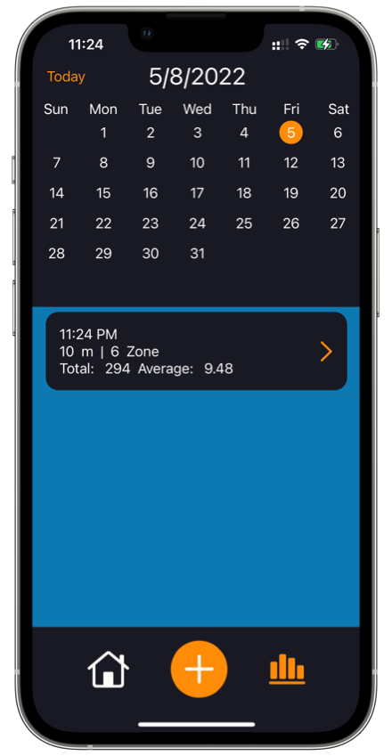
    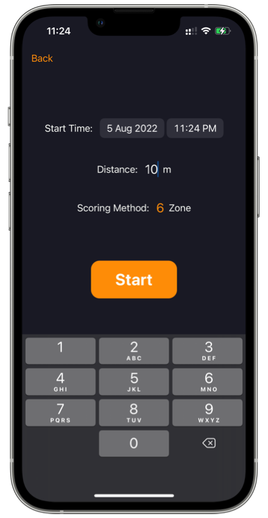
    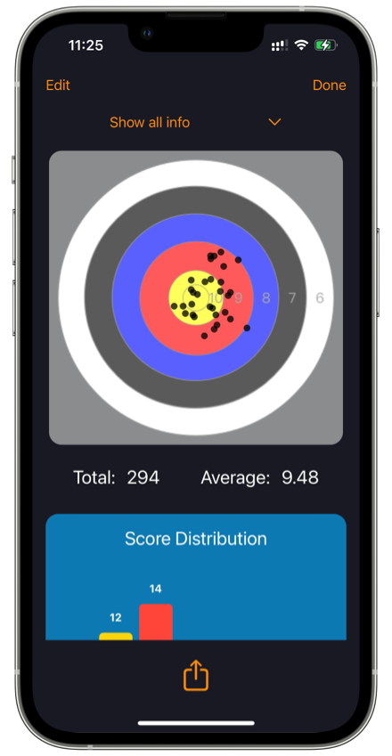

### [Movie](https://github.com/ElvisWong213/Movie)

This application allows users to explore and discover a vast collection of movies using the TMDB API. With the Movie App, users can stay up-to-date with the latest movie releases, search for their favorite films, explore detailed movie information, access reviews, and delve into the cast and crew details. Additionally, the app provides recommendations for similar movies, enhancing the user's movie-watching experience.

#### Framework Used

| SwiftUI :iphone: | WebKit :earth_americas: | Networking (Async/Await) :globe_with_meridians: | TMDB API |
|------------------|-------------------------|------------------------------------------------|----------|

    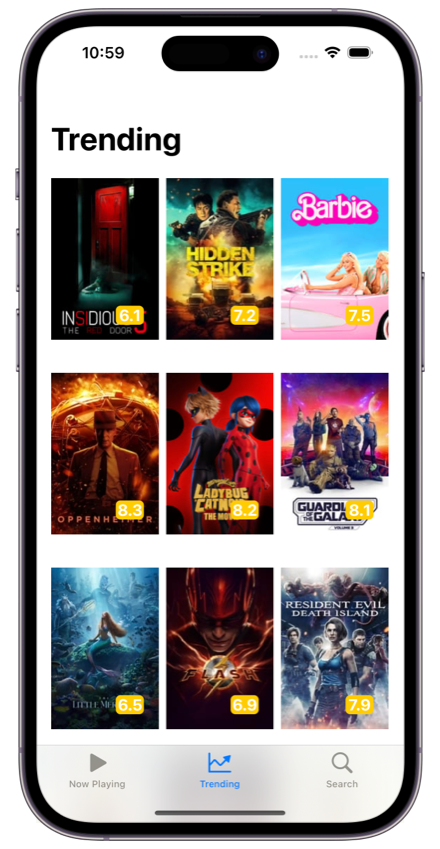
    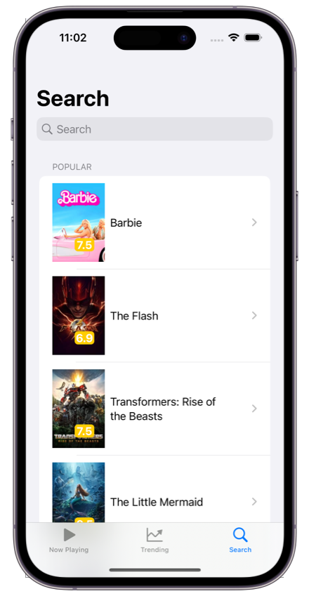
    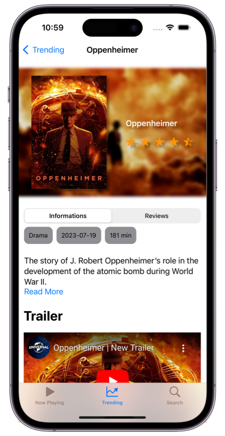

### [Calculator](https://github.com/ElvisWong213/Calculator_Swift)

This app can perform basic calculations and it can store previous answer  

#### Framework Used

| SwiftUI :iphone: | CoreData :floppy_disk: |
|-----------|------------|

    
    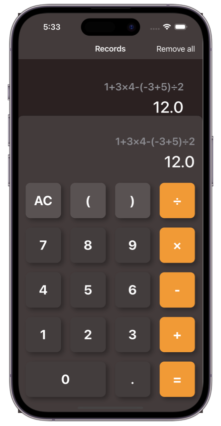
    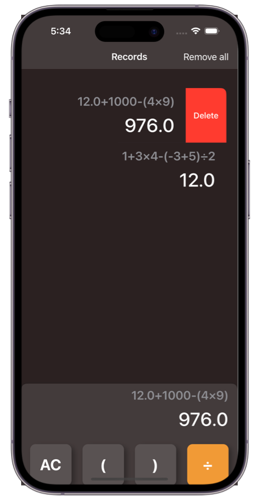

### [HK Weather](https://github.com/ElvisWong213/HK_Weather)

HK Weather is a comprehensive weather app built using SwiftUI. With this app, users can easily access the latest weather information for Hong Kong for up to 9 days in advance. The app provides real-time weather updates, ensuring that you always have the most up-to-date information at your fingertips.

#### Framework Used

| SwiftUI :iphone: | CoreLocation :round_pushpin: | WidgetKit :control_knobs: | WatchKit :watch: | Networking :globe_with_meridians: |
|------------------|------------------------------|---------------------------|------------------|-----------------------------------|

    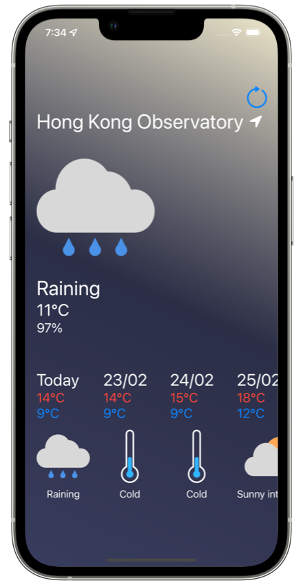
    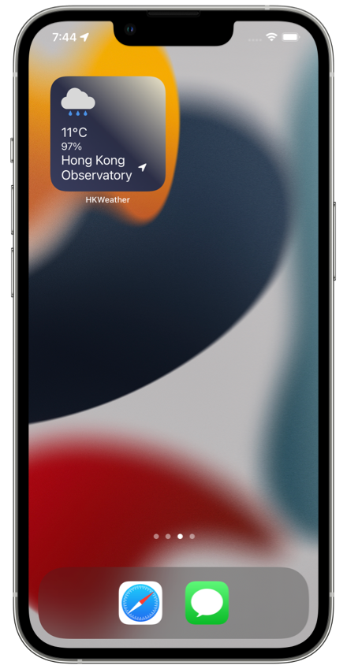
    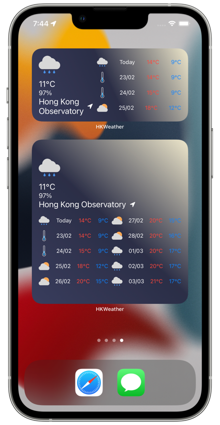

<!--
**ElvisWong213/ElvisWong213** is a ✨ _special_ ✨ repository because its `README.md` (this file) appears on your GitHub profile.

Here are some ideas to get you started:

- 🔭 I’m currently working on ...
- 🌱 I’m currently learning ...
- 👯 I’m looking to collaborate on ...
- 🤔 I’m looking for help with ...
- 💬 Ask me about ...
- 📫 How to reach me: ...
- 😄 Pronouns: ...
- ⚡ Fun fact: ...
-->
